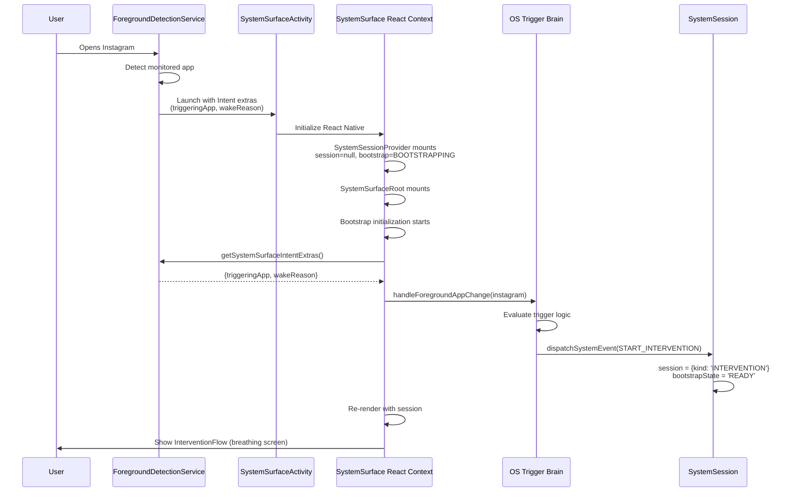

# Context Mismatch Fix - SystemSession Creation

**Date:** January 5, 2026  
**Issue:** SystemSession created in wrong React context, causing app hang  
**Root Cause:** OS Trigger Brain running in MainActivity context instead of SystemSurfaceActivity context  
**Solution:** Run OS Trigger Brain ONLY in SystemSurface context, initialize from Intent extras

---

## Problem Summary

When Instagram was opened, the following occurred:

1. **MainActivity context**: Foreground app event triggered OS Trigger Brain
2. **MainActivity context**: `START_INTERVENTION` dispatched in MainActivity's SystemSession
3. **SystemSurfaceActivity launched**: New Android Activity with fresh React Native context
4. **SystemSurfaceActivity context**: SystemSession starts with `session = null, bootstrapState = 'BOOTSTRAPPING'`
5. **No connection**: Session from MainActivity doesn't transfer to SystemSurfaceActivity
6. **Result**: SystemSurfaceActivity waits forever in bootstrap phase → **Instagram hangs with no UI**

### The Architectural Violation

Per `system_surface_bootstrap.md` (lines 179-216):

**JavaScript (MainApp Context) MUST NOT:**
- Create or modify SystemSession
- Dispatch START_* events

**JavaScript (SystemSurface Context) MUST:**
- Run OS Trigger Brain
- Decide whether to create SystemSession
- Dispatch START_* events

**What was happening (WRONG):**
- OS Trigger Brain ran in MainActivity context
- `START_INTERVENTION` dispatched in MainActivity's SystemSession
- SystemSurfaceActivity had no session

---

## Solution Overview

### Part 1: Prevent MainApp from Creating Sessions

Make OS Trigger Brain connection conditional on runtime context:
- **MAIN_APP context**: Do NOT connect OS Trigger Brain dispatcher
- **SYSTEM_SURFACE context**: Connect OS Trigger Brain dispatcher

### Part 2: Bootstrap Initialization in SystemSurface

When SystemSurfaceActivity's React context initializes:
1. Read Intent extras (triggeringApp, wakeReason)
2. Run OS Trigger Brain in THIS context
3. OS Trigger Brain evaluates and dispatches session event
4. Session created in the CORRECT context
5. Bootstrap exits, UI renders

---

## Implementation Details

### Change 1: Conditional OS Trigger Brain Connection

**File:** [`app/App.tsx`](app/App.tsx)

**Before:**
```typescript
useEffect(() => {
  setSystemSessionDispatcher(dispatchSystemEvent);
  console.log('[App] Connected OS Trigger Brain to SystemSession dispatcher');
}, [dispatchSystemEvent]);
```

**After:**
```typescript
useEffect(() => {
  if (runtime === 'SYSTEM_SURFACE') {
    setSystemSessionDispatcher(dispatchSystemEvent);
    console.log('[App] ✅ Connected OS Trigger Brain (SYSTEM_SURFACE context)');
  } else {
    console.log('[App] ⏭️ Skipping OS Trigger Brain (MAIN_APP context)');
  }
}, [dispatchSystemEvent, runtime]);
```

**Why this works:**
- MainActivity context: OS Trigger Brain dispatcher NOT connected → no session events dispatched
- SystemSurfaceActivity context: OS Trigger Brain dispatcher connected → session events work correctly

---

### Change 2: Bootstrap Initialization

**File:** [`app/roots/SystemSurfaceRoot.tsx`](app/roots/SystemSurfaceRoot.tsx)

**Added:**
```typescript
const [bootstrapInitialized, setBootstrapInitialized] = useState(false);

useEffect(() => {
  if (bootstrapInitialized) return;

  const initializeBootstrap = async () => {
    try {
      // t9: Read Intent extras from native
      const extras = await AppMonitorModule.getSystemSurfaceIntentExtras();
      
      if (!extras || !extras.triggeringApp) {
        dispatchSystemEvent({ type: 'END_SESSION' });
        setBootstrapInitialized(true);
        return;
      }

      const { triggeringApp, wakeReason } = extras;

      // t10-t11: Run OS Trigger Brain in THIS context
      handleForegroundAppChange({
        packageName: triggeringApp,
        timestamp: Date.now(),
      });

      setBootstrapInitialized(true);
    } catch (error) {
      console.error('[SystemSurfaceRoot] Bootstrap failed:', error);
      dispatchSystemEvent({ type: 'END_SESSION' });
      setBootstrapInitialized(true);
    }
  };

  initializeBootstrap();
}, [bootstrapInitialized, dispatchSystemEvent]);
```

**Timeline (per system_surface_bootstrap.md):**
- **t9**: Read wakeReason + triggeringApp from Intent extras
- **t10**: Run OS Trigger Brain in SystemSurface context
- **t11**: OS Trigger Brain makes decision
- **t12**: Dispatch SystemSession event (START_INTERVENTION, etc.)
- **t13**: Set bootstrapState = READY
- **t14**: SystemSurfaceRoot re-renders based on session

---

### Change 3: Native Method for Intent Extras

**File:** [`plugins/src/android/java/com/anonymous/breakloopnative/AppMonitorModule.kt`](plugins/src/android/java/com/anonymous/breakloopnative/AppMonitorModule.kt)

**Note:** Changes are made in `plugins/src/` and automatically synced to `android/app/src/main/` by the build system.

**Added:**
```kotlin
@ReactMethod
fun getSystemSurfaceIntentExtras(promise: Promise) {
    try {
        val activity = reactApplicationContext.currentActivity
        
        if (activity !is SystemSurfaceActivity) {
            promise.resolve(null)
            return
        }
        
        val intent = activity.intent
        val extras = Arguments.createMap()
        
        val triggeringApp = intent.getStringExtra(SystemSurfaceActivity.EXTRA_TRIGGERING_APP)
        val wakeReason = intent.getStringExtra(SystemSurfaceActivity.EXTRA_WAKE_REASON)
        
        if (triggeringApp != null) {
            extras.putString("triggeringApp", triggeringApp)
        }
        
        if (wakeReason != null) {
            extras.putString("wakeReason", wakeReason)
        }
        
        promise.resolve(extras)
    } catch (e: Exception) {
        promise.reject("GET_INTENT_EXTRAS_ERROR", e.message, e)
    }
}
```

---

## Expected Flow After Fix



---

## Before vs After

### Before (Context Mismatch)

```
MainActivity Context:
  - Foreground event: Instagram
  - OS Trigger Brain runs
  - Dispatches START_INTERVENTION
  - Session created in MainActivity's SystemSession ❌

SystemSurfaceActivity launches:
  - Fresh React context
  - SystemSession starts: session = null, bootstrap = BOOTSTRAPPING
  - No session event dispatched
  - Bootstrap never exits
  - Result: Hang forever ❌
```

### After (Correct Context)

```
MainActivity Context:
  - Foreground event: Instagram
  - OS Trigger Brain NOT connected
  - No session events dispatched ✅

SystemSurfaceActivity launches:
  - Fresh React context
  - SystemSession starts: session = null, bootstrap = BOOTSTRAPPING
  - Bootstrap initialization:
    - Reads Intent extras
    - Runs OS Trigger Brain in THIS context
    - Dispatches START_INTERVENTION in THIS context
  - Session created: session = {kind: 'INTERVENTION'}
  - Bootstrap exits: bootstrapState = READY
  - Result: InterventionFlow renders ✅
```

---

## Why This Fixes The Issue

### Root Cause
**Session created in wrong React context** - MainActivity and SystemSurfaceActivity have separate React Native instances that don't share state.

### Solution
**Create session in the correct context** - SystemSurfaceActivity reads Intent extras and runs OS Trigger Brain in its own context, creating the session where it's consumed.

### Key Principles Preserved

1. **Context Ownership** (system_surface_bootstrap.md lines 179-216)
   - ✅ MainApp context does NOT create sessions
   - ✅ SystemSurface context runs OS Trigger Brain
   - ✅ SystemSurface context creates sessions

2. **Bootstrap Lifecycle** (system_surface_bootstrap.md lines 76-144)
   - ✅ Bootstrap prevents premature finish
   - ✅ Bootstrap exits only after OS Trigger evaluation
   - ✅ Session decision made in correct context

3. **Native-JavaScript Boundary** (NATIVE_JAVASCRIPT_BOUNDARY.md)
   - ✅ Native decides WHEN to wake (Intent extras)
   - ✅ JavaScript decides WHAT to do (OS Trigger Brain)
   - ✅ No logic duplication

---

## Files Modified

1. **`app/App.tsx`**
   - Made OS Trigger Brain connection conditional on `runtime === 'SYSTEM_SURFACE'`
   - Added logging to show which context is active

2. **`app/roots/SystemSurfaceRoot.tsx`**
   - Added `bootstrapInitialized` state
   - Added bootstrap initialization `useEffect`
   - Reads Intent extras via `getSystemSurfaceIntentExtras()`
   - Triggers OS Trigger Brain in SystemSurface context
   - Updated bootstrap phase check to include `bootstrapInitialized`

3. **`plugins/src/android/java/com/anonymous/breakloopnative/AppMonitorModule.kt`**
   - Added `getSystemSurfaceIntentExtras()` method
   - Returns triggeringApp and wakeReason from Intent
   - **Note:** Changes made in `plugins/src/` are automatically synced to `android/app/src/main/` by the build system

---

## Testing

### Test Scenario
1. Build and install app: `npm run android`
2. Enable Accessibility Service
3. Add Instagram to monitored apps
4. Close BreakLoop app
5. Open Instagram

### Expected Result
- SystemSurfaceActivity launches
- Brief moment with no UI (bootstrap initialization)
- Breathing screen appears
- No hang, no home screen flash

### Log Verification

**Expected log sequence:**
```
[App] Rendering for runtime context: SYSTEM_SURFACE
[App] ✅ Connected OS Trigger Brain (SYSTEM_SURFACE context)
[SystemSurfaceRoot] 🚀 Bootstrap initialization starting...
[SystemSurfaceRoot] 📋 Intent extras: {triggeringApp: "com.instagram.android", wakeReason: "MONITORED_APP_FOREGROUND"}
[SystemSurfaceRoot] 🧠 Running OS Trigger Brain in SystemSurface context...
[OS Trigger Brain] Evaluating nested trigger logic for: com.instagram.android
[OS Trigger Brain] → START INTERVENTION FLOW
[SystemSession] Starting INTERVENTION session for app: com.instagram.android
[SystemSession] Bootstrap phase complete - session established
[SystemSurfaceRoot] ✅ Bootstrap initialization complete
[SystemSurfaceRoot] Rendering InterventionFlow for app: com.instagram.android
```

---

## Success Criteria

- ✅ SystemSurfaceActivity no longer hangs
- ✅ Intervention UI appears correctly
- ✅ No home screen flash
- ✅ Session created in correct context
- ✅ Bootstrap completes successfully
- ✅ All context ownership rules preserved

---

## Related Documents

- [`docs/system_surface_bootstrap.md`](docs/system_surface_bootstrap.md) - Authoritative bootstrap lifecycle
- [`docs/NATIVE_JAVASCRIPT_BOUNDARY.md`](docs/NATIVE_JAVASCRIPT_BOUNDARY.md) - Native-JS boundary rules
- [`ARCHITECTURE_v1_frozen.md`](ARCHITECTURE_v1_frozen.md) - Overall architecture
- [`BOOTSTRAP_PHASE_FIX.md`](BOOTSTRAP_PHASE_FIX.md) - Previous bootstrap phase implementation

---

## Conclusion

The context mismatch bug was caused by creating SystemSession in MainActivity's React context instead of SystemSurfaceActivity's context. The fix ensures OS Trigger Brain runs ONLY in SystemSurface context, reading Intent extras to bootstrap correctly. This preserves all architectural rules and fixes the hang issue.
