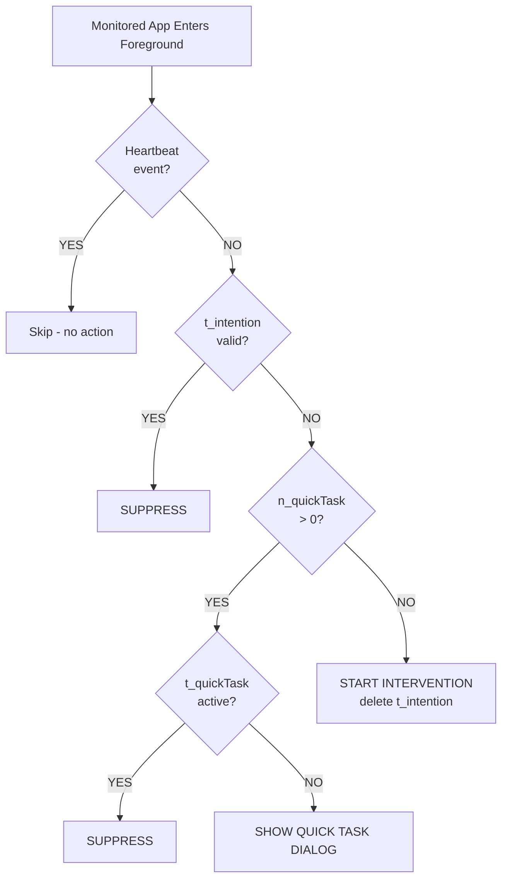

# OS Trigger Logic - Contract V1

**Status:** ✅ CURRENT (Updated January 5, 2026)

---

## Overview

This document defines the trigger logic for monitored app interventions per OS Trigger Contract V1.

The logic uses a **nested decision tree** with three key timers/counters:
- **`t_intention`** (per-app) - Intention timer set by user during intervention
- **`t_quickTask`** (per-app) - Active Quick Task timer
- **`n_quickTask`** (global) - Quick Task usage count across all apps

---

## Decision Tree

When a monitored app enters foreground:

```
START: Monitored App Enters Foreground
    ↓
[Is this a heartbeat event?] ─YES→ SKIP (no action)
    ↓ NO
[Check t_intention for this app]
    ↓
[t_intention != 0?] ─YES→ SUPPRESS (valid intention timer)
    ↓ NO (t_intention = 0)
[Check n_quickTask (global)]
    ↓
[n_quickTask != 0?]
    ↓ YES
    [Check t_quickTask for this app]
        ↓
    [t_quickTask != 0?] ─YES→ SUPPRESS (active Quick Task)
        ↓ NO (t_quickTask = 0)
    SHOW QUICK TASK DIALOG
    ↓ NO (n_quickTask = 0)
START INTERVENTION FLOW
(delete t_intention, show breathing screen)
```

---

## Mermaid Diagram



---

## Key Rules

### 1. Priority Order
1. **Heartbeat detection** - Skip if same app (no actual switch)
2. **`t_intention`** - If valid, suppress everything
3. **`n_quickTask`** - If > 0, check `t_quickTask`
4. **`t_quickTask`** - If active, suppress; else show dialog
5. **Default** - If no Quick Task available, start intervention

### 2. Timer Semantics

**`t_intention` (per-app):**
- Set by user during intervention flow (e.g., "I want to use Instagram for 5 minutes")
- Suppresses intervention when valid
- **Deleted every time intervention starts/restarts**
- When expires while user in app → intervention starts again

**`t_quickTask` (per-app):**
- Set when user activates Quick Task (emergency bypass)
- Suppresses intervention while active
- Each app has independent timer
- Does NOT create or extend `t_intention`

**`n_quickTask` (global):**
- Usage count across ALL monitored apps
- Example: 1 use per 15-minute window
- Using Quick Task on Instagram consumes quota for TikTok too

### 3. Intervention Start Behavior

When intervention starts:
1. Delete `t_intention` for this app
2. Mark intervention as in-progress
3. Dispatch `BEGIN_INTERVENTION` action
4. Navigate to breathing screen

### 4. Quick Task Expiry Behavior

When Quick Task expires:
1. Clear `t_intention` for the expired app (reset to 0)
2. Show QuickTaskExpiredScreen
3. User must acknowledge and return to home

---

## Per-App Isolation

Each monitored app is evaluated independently:

**Example Scenario:**
- Instagram: `t_intention = 120s`, `t_quickTask = 0`
- TikTok: `t_intention = 0`, `t_quickTask = 180s`
- Global: `n_quickTask = 1` (1 use remaining)

**User opens Instagram:**
- Check `t_intention` → 120s remaining → **SUPPRESS**

**User opens TikTok:**
- Check `t_intention` → 0 (expired)
- Check `n_quickTask` → 1 (available)
- Check `t_quickTask` → 180s remaining → **SUPPRESS**

**User opens Reddit (not monitored):**
- No intervention logic runs

---

## Implementation Location

**File:** `src/os/osTriggerBrain.ts`

**Key Functions:**
- `handleForegroundAppChange()` - Entry point for all app changes
- `evaluateTriggerLogic()` - Implements nested decision tree
- `startInterventionFlow()` - Starts intervention, deletes `t_intention`
- `showQuickTaskDialog()` - Shows Quick Task decision screen

---

## Testing Scenarios

### Scenario 1: First Launch
- User opens Instagram (first time ever)
- `t_intention = 0` (not set)
- `n_quickTask = 1` (available)
- `t_quickTask = 0` (not active)
- **Result:** Show Quick Task dialog

### Scenario 2: Valid Intention Timer
- User opens Instagram
- `t_intention = 120s` (valid)
- **Result:** SUPPRESS (no intervention, no Quick Task dialog)

### Scenario 3: Expired Intention Timer
- User in Instagram with `t_intention = 30s`
- Timer expires while user still in app
- `n_quickTask = 0` (no uses remaining)
- **Result:** START INTERVENTION

### Scenario 4: Active Quick Task
- User opens Instagram
- `t_intention = 0`
- `n_quickTask = 1`
- `t_quickTask = 180s` (active)
- **Result:** SUPPRESS (Quick Task active)

### Scenario 5: Per-App Independence
- Instagram: `t_intention = 120s`
- User switches to TikTok
- TikTok: `t_intention = 0`
- **Result:** TikTok evaluates independently (Instagram's timer doesn't affect it)

---

## Related Documentation

- `OS_TRIGGER_LOGIC_REFACTOR_SUMMARY.md` - Implementation changes
- `OS_TRIGGER_LOGIC_TEST_SCENARIOS.md` - Comprehensive test scenarios
- `NATIVE_JAVASCRIPT_BOUNDARY.md` - Native-JS boundary contract
