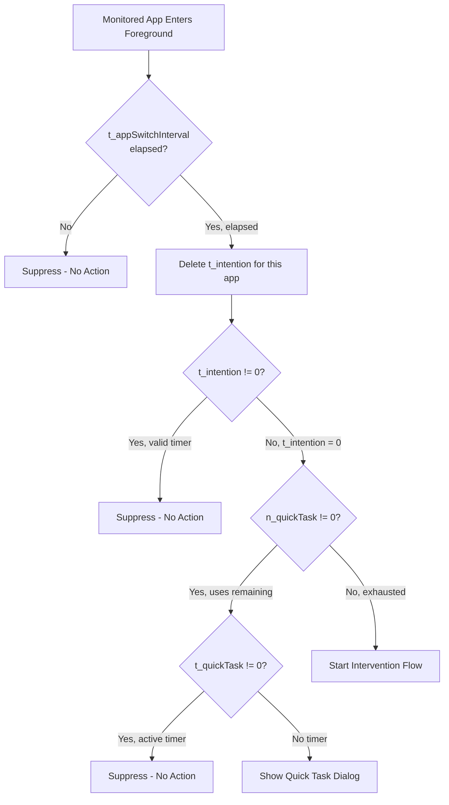
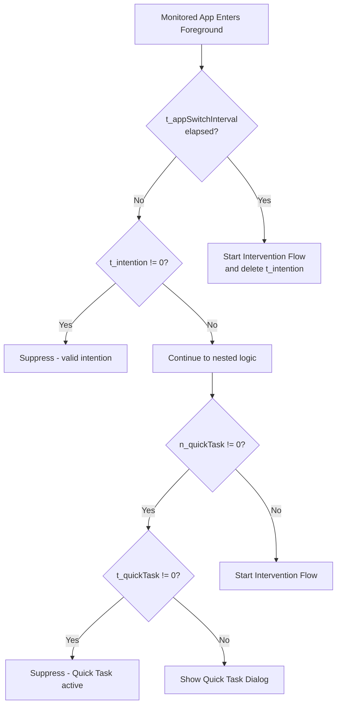

# Fix Trigger Logic Priority

**Overview:** Refactor the OS Trigger Brain to implement the correct nested priority logic for intervention and Quick Task triggers, ensuring t_appSwitchInterval has higher priority than t_intention, and implementing the proper nested decision tree structure.

## Problem Summary

The current implementation in `osTriggerBrain.ts` has the wrong priority order and uses a flat priority chain instead of the nested logic specified in the contract.

**Current (WRONG):**

1. Check t_quickTask (active timer) - suppress
2. Check alternative activity - suppress  
3. Check t_intention - suppress
4. Check n_quickTask > 0 - show Quick Task dialog
5. Else - start intervention

**Correct (per spec):**

1. Check t_appSwitchInterval FIRST (higher priority than t_intention)
2. Then use nested logic:

   - if t_intention != 0: no dialog, no intervention
   - if t_intention = 0:
     - if n_quickTask != 0:
       - if t_quickTask != 0: no dialog, no intervention
       - if t_quickTask = 0: show Quick Task dialog
     - if n_quickTask = 0: start intervention

---

## Architecture Change

The logic should be restructured in `handleForegroundAppChange()` to:



---

## Key Changes Required

### 1. Refactor `handleForegroundAppChange()` in [src/os/osTriggerBrain.ts](src/os/osTriggerBrain.ts)

**Current flow (lines 619-756):**

- Checks Quick Task timer first (wrong)
- Checks intention timer second (wrong priority vs app switch)
- Checks app switch interval last (should be first)

**New flow:**

1. Check if this is a monitored app
2. Check t_appSwitchInterval FIRST

   - If NOT elapsed: suppress (no intervention, no dialog)
   - If elapsed: delete t_intention for this app, continue to nested logic

3. Apply nested decision tree (call refactored `triggerIntervention()`)

### 2. Refactor `triggerIntervention()` in [src/os/osTriggerBrain.ts](src/os/osTriggerBrain.ts)

**Current implementation (lines 245-361):**

```typescript
// PRIORITY 1: Quick Task ACTIVE (per-app)
// PRIORITY 2: Alternative Activity RUNNING
// PRIORITY 3: t_intention VALID
// PRIORITY 4: n_quickTask > 0
// PRIORITY 5: Start Intervention
```

**New nested implementation:**

```typescript
function triggerIntervention(packageName: string, timestamp: number): void {
  // Step 1: Check t_intention
  if (hasValidIntentionTimer(packageName, timestamp)) {
    // t_intention != 0: suppress everything
    return;
  }
  
  // Step 2: t_intention = 0, check n_quickTask
  const quickTaskRemaining = getQuickTaskRemaining(packageName, timestamp);
  
  if (quickTaskRemaining > 0) {
    // n_quickTask != 0: check t_quickTask
    if (hasActiveQuickTaskTimer(packageName, timestamp)) {
      // t_quickTask != 0: suppress everything
      return;
    }
    // t_quickTask = 0: show Quick Task dialog
    interventionDispatcher({ type: 'SHOW_QUICK_TASK', ... });
    return;
  }
  
  // n_quickTask = 0: start intervention flow
  interventionDispatcher({ type: 'BEGIN_INTERVENTION', ... });
}
```

### 3. Update t_appSwitchInterval priority in `handleForegroundAppChange()`

Move the app switch interval check to happen BEFORE any other checks:

```typescript
// lines ~690-756 need restructuring
// FIRST: Check app switch interval
const lastExitTimestamp = lastMeaningfulExitTimestamps.get(packageName);
const intervalMs = getAppSwitchIntervalMs();

if (lastExitTimestamp !== undefined) {
  const timeSinceExit = timestamp - lastExitTimestamp;
  if (timeSinceExit < intervalMs) {
    // t_appSwitchInterval NOT elapsed: suppress everything
    console.log('[OS Trigger Brain] Within app switch interval — suppressing');
    return;
  }
}

// t_appSwitchInterval elapsed (or first entry): 
// Delete t_intention for this app (per spec: "t_intention shall be deleted")
intentionTimers.delete(packageName);

// Now run the nested decision logic
triggerIntervention(packageName, timestamp);
```

### 4. Handle intention timer expiration case

When t_intention expires while user is in the app (checked by `checkForegroundIntentionExpiration`):

- The expired timer should trigger intervention
- But still respect t_appSwitchInterval priority

**Current code (lines 974-1059):** Calls `triggerIntervention()` directly when timer expires.

**Change needed:** The expiration should delete the timer and then go through the normal logic, which will trigger intervention because t_intention = 0.

---

## Validation Checklist

After implementation, verify these scenarios:

1. **t_appSwitchInterval NOT elapsed** - User opens monitored app within interval

   - Expected: No intervention, no Quick Task dialog (even if t_intention expired)

2. **t_appSwitchInterval elapsed, t_intention valid** - User returns after interval, has valid intention timer

   - Expected: t_intention deleted, then... (wait, spec says delete t_intention when intervention STARTS, not when app switch elapsed)

**WAIT - Need to re-read the spec more carefully:**

The spec says:

- "When t_appSwitchInterval is over, the intervention should start. Since intervention flow will restart, the t_intention for this app shall be deleted."

This means:

- t_appSwitchInterval elapsed → intervention STARTS → t_intention deleted
- NOT: t_appSwitchInterval elapsed → t_intention deleted → check nested logic

Let me revise:

---

## Revised Logic Flow



**Key insight:** When t_appSwitchInterval is OVER (elapsed), intervention MUST start regardless of t_intention. The t_intention check only matters when t_appSwitchInterval is NOT over.

---

## Final Implementation Plan

### Step 1: Restructure `handleForegroundAppChange()` for monitored apps

```typescript
// After confirming app is monitored and not a heartbeat:

// FIRST: Check t_appSwitchInterval (HIGHEST PRIORITY)
const lastExitTimestamp = lastMeaningfulExitTimestamps.get(packageName);
const intervalMs = getAppSwitchIntervalMs();

let appSwitchIntervalElapsed = false;
if (lastExitTimestamp === undefined) {
  // First entry ever - treat as elapsed
  appSwitchIntervalElapsed = true;
} else {
  const timeSinceExit = timestamp - lastExitTimestamp;
  appSwitchIntervalElapsed = timeSinceExit >= intervalMs;
}

if (appSwitchIntervalElapsed) {
  // t_appSwitchInterval elapsed → Start intervention, delete t_intention
  console.log('[OS Trigger Brain] App switch interval elapsed — starting intervention');
  intentionTimers.delete(packageName); // Delete t_intention
  startInterventionFlow(packageName, timestamp); // New function for intervention
  return;
}

// t_appSwitchInterval NOT elapsed → Apply nested logic
evaluateTriggerLogic(packageName, timestamp);
```

### Step 2: Create `evaluateTriggerLogic()` function with nested structure

```typescript
function evaluateTriggerLogic(packageName: string, timestamp: number): void {
  // Step 1: Check t_intention
  if (hasValidIntentionTimer(packageName, timestamp)) {
    console.log('[OS Trigger Brain] Valid t_intention — suppressing');
    return; // Suppress
  }
  
  // t_intention = 0 (expired or not set)
  
  // Step 2: Check n_quickTask
  const quickTaskRemaining = getQuickTaskRemaining(packageName, timestamp);
  
  if (quickTaskRemaining > 0) {
    // n_quickTask != 0: Check t_quickTask
    if (hasActiveQuickTaskTimer(packageName, timestamp)) {
      console.log('[OS Trigger Brain] Active t_quickTask — suppressing');
      return; // Suppress
    }
    // t_quickTask = 0: Show Quick Task dialog
    showQuickTaskDialog(packageName, quickTaskRemaining);
    return;
  }
  
  // n_quickTask = 0: Start intervention
  startInterventionFlow(packageName, timestamp);
}
```

### Step 3: Extract `startInterventionFlow()` helper

Move the intervention start logic (currently lines 311-360) to a dedicated function.

### Step 4: Update `checkForegroundIntentionExpiration()` 

When t_intention expires while user is in the app:

- Delete the timer
- Re-evaluate using `evaluateTriggerLogic()` (not directly start intervention)

---

## Summary of Changes

| Location | Change |
|----------|--------|
| `handleForegroundAppChange()` | Restructure to check t_appSwitchInterval FIRST, then call nested logic |
| `triggerIntervention()` | Rename to `evaluateTriggerLogic()` and implement nested structure |
| New `startInterventionFlow()` | Extract intervention start logic to reusable function |
| `checkForegroundIntentionExpiration()` | Update to use new nested logic flow |

---

## Per-App Isolation (Confirmed)

The spec states "Every app shall be treated as individual". The current implementation already handles this correctly, and the plan will preserve it:

**Per-App (keyed by packageName):**

- `t_intention` - `intentionTimers: Map<string, {expiresAt}>` - each app has its own intention timer
- `t_quickTask` - `quickTaskTimers: Map<string, {expiresAt}>` - each app has its own Quick Task timer
- `t_appSwitchInterval` - `lastMeaningfulExitTimestamps: Map<string, number>` - each app tracks its own exit time

**Global (shared across all apps):**

- `n_quickTask` - `quickTaskUsageHistory: number[]` - usage count is global across all monitored apps

**Example Scenario:**

- User opens Instagram (monitored) - triggers intervention
- User sets 5-minute intention timer for Instagram
- User switches to TikTok (also monitored) - TikTok has NO intention timer, will trigger its own evaluation
- Instagram's t_intention does NOT affect TikTok's logic
- If user uses Quick Task on TikTok, it consumes global n_quickTask, but t_quickTask timer is only for TikTok

This per-app isolation is critical and will be preserved in the refactored implementation.

---

## Files to Modify

- [src/os/osTriggerBrain.ts](src/os/osTriggerBrain.ts) - Main logic changes

---

## Implementation Status

All tasks completed:

- ✅ Restructure handleForegroundAppChange() to check t_appSwitchInterval FIRST with highest priority
- ✅ Create evaluateTriggerLogic() function with correct nested decision tree structure
- ✅ Extract startInterventionFlow() helper function for intervention logic
- ✅ Update checkForegroundIntentionExpiration() to use new nested logic
- ✅ Remove or refactor old triggerIntervention() function
- ✅ Add clear logging for each decision branch for debugging
- ✅ Document test scenarios for validation
