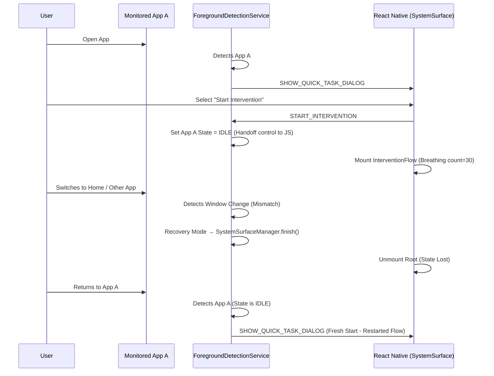

# Intervention Audit Results: Preservation, Authority, and Hook Reuse (v3)

This document consolidates the findings of the three-part audit performed on the current BreakLoop development codebase against the **Intervention Contract V3** specifications.

---

## 1. Behavior Audit: Current Preservation vs. Clearing

### Intervention Progress Storage
*   **Location**: `src/contexts/InterventionProvider.tsx` (React Context)
*   **Storage Type**: **Volatile JS Memory** (In-memory reducer state).
*   **Persistence**: None. There is no backup to `AsyncStorage`, `Redux-Persist`, or Native `SharedPreferences`. State is wiped on Activity destruction.

### App-Switch Detection
*   **File**: `android/app/src/main/java/com/anonymous/breakloopnative/ForegroundDetectionService.kt`
*   **Mechanism**: `onAccessibilityEvent` monitoring `TYPE_WINDOW_STATE_CHANGED`.
*   **Logic**: Native detects if the foreground package no longer matches the `underlyingApp`. If a mismatch persists beyond the 800ms "Hard Recovery" window, the Activity is killed.

### Cancel vs. Resume Triggers
*   **Current Trigger**: **Always Cancel**.
*   **Trigger Logic**: `ForegroundDetectionService.onSurfaceExit` calls `SystemSurfaceManager.finish()`, which destroys the React Root view. 
*   **Re-entry Result**: Because Native resets the app state to `IDLE` upon the first "Start Intervention" handoff, returning to the app causes Native to see an `IDLE` state and start a **fresh** `SHOW_QUICK_TASK` flow, completely bypassing any progress.

### Current Sequence Diagram: Enter App → Switch → Re-enter

---

## 2. Authority Audit: Ownership vs. V3 Spec

| Decision | Current Owner | Should Owner (V3) | Alignment | Fix Required |
| :--- | :--- | :--- | :--- | :--- |
| **Start / Suppress** | **Native** (`ForegroundDetectionService`) | **Native** | ✅ Aligned | None. |
| **Store `t_intention`** | **Hybrid** (JS calc → Native store) | **Native** | ⚠️ Partial | Native enforces it via generic `suppressWake`. V3 prefers explicit awareness. |
| **UI Launch** | **JS** (`eventHandler.ts`) | **Native** | ❌ **Misaligned** | Native should launch `SystemSurfaceActivity` directly via Intent. |
| **Cancel vs Preserve** | **Native** (`onSurfaceExit`) | **Native** | ❌ **Broken** | Native currently **kills** state on switch. Must preserve if `IN_PROGRESS`. |
| **Screen Navigation** | **JS** (`InterventionFlow.tsx`) | **JS** | ✅ Aligned | JS correctly manages screen order. |

### Citations
*   **Native Kill Logic**: `ForegroundDetectionService.kt` (lines 599-600) calls `onSurfaceExit` and `finish()`.
*   **State Reset**: `ForegroundDetectionService.kt` (line 429) sets `entry.state = IDLE` once intervention starts, losing the "In Progress" context.
*   **JS Launch**: `src/systemBrain/eventHandler.ts` (line 402) Reacts to `SHOW_QUICK_TASK_DIALOG` by calling Native bridge.

---

## 3. Hook Reuse: Candidate Functions

Existing hooks in `AppMonitorModule.kt` can be repurposed to bridge the V3 gap.

| Desired V3 Functionality | Existing Candidate | Repurpose / Rename Path |
| :--- | :--- | :--- |
| **Check for Resumable State** | `getInitialTriggeringApp` | Expand to `getInterventionBootstrapData(app)` (returns progress + step). |
| **Store Progress (Persistent)** | `storeQuickTaskTimer` | Use this pattern to create `storeInterventionProgress(app, step, data)`. |
| **Finalize (Clear State)** | `finishInterventionActivity` | Rename to `finalizeIntervention(app)` and clear SharedPrefs on call. |
| **Suspend (App Switch)** | `onSurfaceExit` | **Logic Shift**: If `state == IN_PROGRESS`, call `persistState` from JS before Native calls `finish()`. |
| **Enforce Intention** | `storeIntentionTimer` | Continue using this; it is already per-app and persisted in `intention_timers`. |

### Persistent Storage Plan
Currently, `AppMonitorModule.kt` stores timers in:
*   `quick_task_timers` SharedPreferences
*   `intention_timers` SharedPreferences

**V3 Proposal**: Create `intervention_persistence` SharedPreferences keyed by package name containing a JSON string of the current step and remaining work (e.g., `{"step": "breathing", "count": 14}`).

---
*Audit Completed on 2026-01-29*
