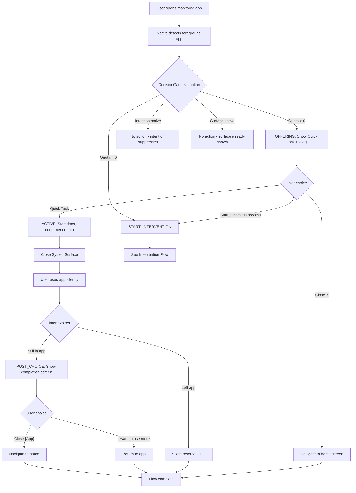
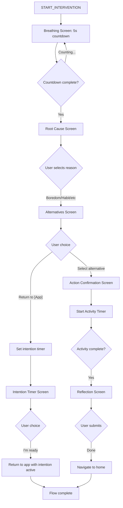
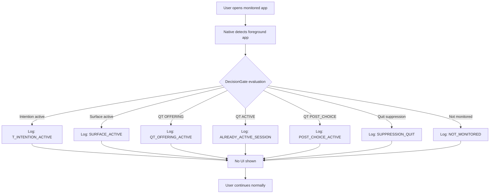
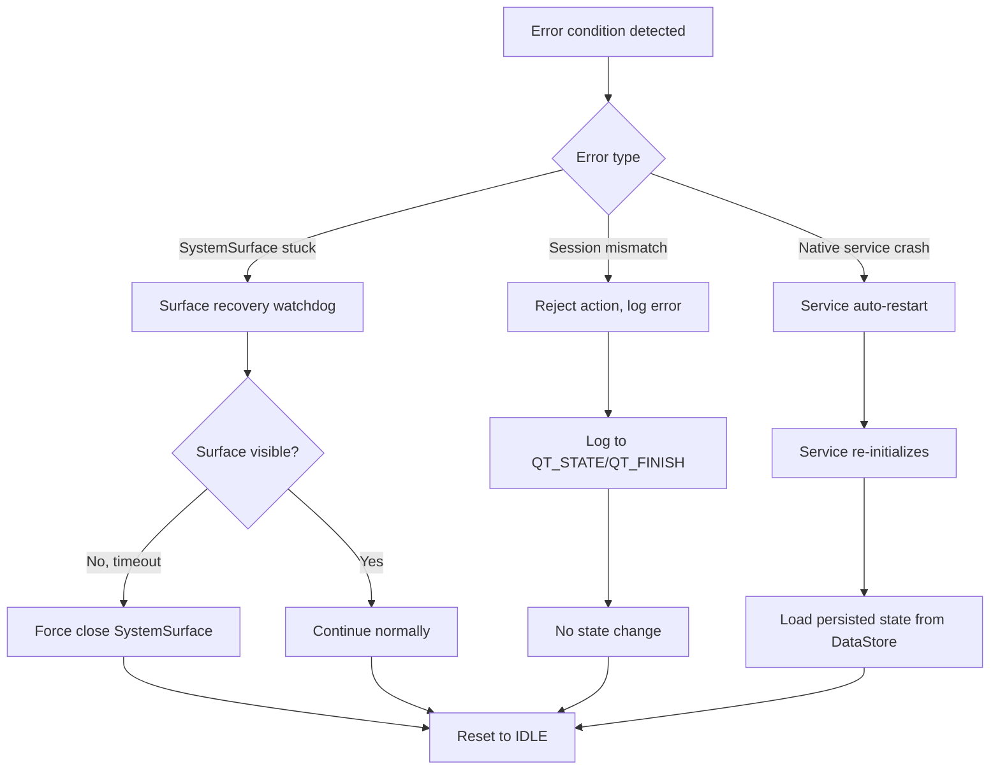

# User Flow Documentation

This document describes all user-facing flows in the BreakLoop Android app based on the current implementation.

## Overview

BreakLoop monitors user-selected apps and intervenes when they are opened. The system offers two paths:
1. **Quick Task** - Time-limited app usage (quota-based)
2. **Intervention** - Full conscious process flow

---

## Flow Diagrams

### 1. Quick Task Flow



### 2. Intervention Flow



### 3. No-Action Flow



### 4. Fallback/Error Flow



---

## Detailed Flow Steps

### Quick Task Flow (Complete)

#### Step 1: Monitored App Entry
- **Trigger**: User opens a monitored app (e.g., Instagram)
- **Native Action**: `ForegroundDetectionService` detects via AccessibilityService
- **Surface**: None (background detection)
- **User Actions**: None
- **Exit Conditions**: App detected successfully
- **Next Step**: Decision Gate evaluation

#### Step 2: Decision Gate Evaluation
- **Trigger**: App entry detected
- **Native Action**: `DecisionGate.evaluate()` checks all conditions
- **Surface**: None (pure logic)
- **User Actions**: None
- **Exit Conditions**: 
  - Quota > 0 → Show Quick Task Dialog
  - Quota = 0 → Start Intervention
  - Intention active → No action
  - Surface already active → No action
- **Next Step**: Based on decision result

#### Step 3: Quick Task Dialog (OFFERING)
- **Trigger**: DecisionGate returns `START_QUICK_TASK`
- **Native Action**: Launch `SystemSurfaceActivity` with `WAKE_REASON_SHOW_QUICK_TASK`
- **Surface**: `QuickTaskDialogScreen` (full-screen modal)
- **User Actions**:
  - "Start conscious process" → Switch to Intervention
  - "Quick Task" → Confirm and start timer
  - Close (X) → Navigate to home
- **Exit Conditions**: User makes a choice
- **Next Step**: Based on user action
- **Timeout**: None (blocking)
- **Back Behavior**: Disabled (must use buttons)

#### Step 4: Quick Task Active (ACTIVE)
- **Trigger**: User confirms "Quick Task"
- **Native Action**: 
  - Transition OFFERING → ACTIVE
  - Decrement quota
  - Start native timer (duration from settings)
  - Close SystemSurface
- **Surface**: None (silent background timer)
- **User Actions**: Uses app normally
- **Exit Conditions**: 
  - Timer expires while in app → Show Post-QT Choice
  - Timer expires while away → Silent reset
  - User switches apps → Timer continues
- **Next Step**: Post-QT Choice or Silent reset

#### Step 5: Post-Quick Task Choice (POST_CHOICE)
- **Trigger**: Timer expires while user still in monitored app
- **Native Action**: Launch SystemSurfaceActivity with `WAKE_REASON_SHOW_POST_QUICK_TASK_CHOICE`
- **Surface**: `PostQuickTaskChoiceScreen` (full-screen modal)
- **User Actions**:
  - "Close [App]" → Navigate to home (no suppression)
  - "I want to use [App] more" → Return to app
- **Exit Conditions**: User makes a choice
- **Next Step**: Home or app return
- **Timeout**: None (blocking)
- **Back Behavior**: Treated as "Close [App]"

### Intervention Flow (Complete)

#### Step 1: Breathing Screen
- **Trigger**: START_INTERVENTION event
- **Native Action**: Launch SystemSurfaceActivity with `WAKE_REASON_SHOW_INTERVENTION`
- **Surface**: `BreathingScreen` (full-screen, centered countdown)
- **User Actions**: None (passive countdown)
- **Exit Conditions**: Countdown reaches 0 (default 5 seconds)
- **Next Step**: Root Cause Screen
- **Timeout**: Automatic after countdown
- **Back Behavior**: Disabled

#### Step 2: Root Cause Screen
- **Trigger**: Breathing countdown complete
- **Surface**: `RootCauseScreen` (selection screen)
- **User Actions**: Select reason (Boredom, Habit, Stress, etc.)
- **Exit Conditions**: User selects a reason
- **Next Step**: Alternatives Screen
- **Timeout**: None
- **Back Behavior**: Disabled

#### Step 3: Alternatives Screen
- **Trigger**: User selects root cause
- **Surface**: `AlternativesScreen` (list of alternatives)
- **User Actions**:
  - Select an alternative activity → Action Confirmation
  - "Return to [App]" → Set intention timer
- **Exit Conditions**: User makes a choice
- **Next Step**: Action Confirmation or Intention Timer
- **Timeout**: None
- **Back Behavior**: Disabled

#### Step 4a: Action Confirmation Screen
- **Trigger**: User selects alternative activity
- **Surface**: `ActionConfirmationScreen`
- **User Actions**: Confirm to start activity
- **Exit Conditions**: User confirms
- **Next Step**: Activity Timer
- **Timeout**: None
- **Back Behavior**: Returns to Alternatives

#### Step 5a: Activity Timer Screen
- **Trigger**: User confirms alternative activity
- **Surface**: `ActivityTimerScreen` (countdown timer)
- **User Actions**: Wait for timer or complete early
- **Exit Conditions**: Timer complete or user confirms completion
- **Next Step**: Reflection Screen
- **Timeout**: Automatic
- **Back Behavior**: Disabled

#### Step 6a: Reflection Screen
- **Trigger**: Activity timer complete
- **Surface**: `ReflectionScreen`
- **User Actions**: Submit reflection
- **Exit Conditions**: User submits
- **Next Step**: Navigate to home
- **Timeout**: None
- **Back Behavior**: Disabled

#### Step 4b: Intention Timer Screen
- **Trigger**: User chooses "Return to [App]"
- **Surface**: `IntentionTimerScreen` (timer setup)
- **User Actions**: "I'm ready" to return
- **Exit Conditions**: User confirms
- **Next Step**: Return to app with intention active
- **Timeout**: None
- **Back Behavior**: Disabled

---

## State Transitions

### Quick Task State Machine

```
IDLE → OFFERING → ACTIVE → POST_CHOICE → IDLE
  ↓                ↓
  └────────────────┴─→ INTERVENTION_ACTIVE
```

### Intervention State Machine

```
idle → breathing → root-cause → alternatives → action → action_timer → reflection → idle
                                      ↓
                                    timer → idle
```

---

## Navigation Rules

1. **SystemSurface is blocking**: User cannot access other apps while SystemSurface is active
2. **Hardware back button**: Disabled on all intervention/QT screens
3. **Home navigation**: Explicit actions only (Close button, "Close [App]" button)
4. **App return**: Only via "Continue" or "Return to [App]" buttons
5. **Flow isolation**: Quick Task and Intervention flows are independent (can switch QT → Intervention)

---

## Error Handling

### Session Mismatch
- **Trigger**: User action with wrong session ID
- **Action**: Log error, reject action, no state change
- **User Impact**: None (action silently ignored)

### Surface Stuck
- **Trigger**: SystemSurface doesn't mount within timeout
- **Action**: Watchdog force-closes surface
- **User Impact**: Surface disappears, can re-enter app

### Timer Expiry While Away
- **Trigger**: QT timer expires but user not in app
- **Action**: Silent reset to IDLE, no UI shown
- **User Impact**: None (transparent)

### Native Service Crash
- **Trigger**: ForegroundDetectionService crashes
- **Action**: Android auto-restarts service, loads persisted state
- **User Impact**: Brief monitoring gap, state preserved

---

## Notes

- All flows are **deterministic** - same inputs produce same outputs
- **No race conditions** - state transitions are atomic and locked
- **Idempotent actions** - duplicate calls are safely ignored
- **Persistent state** - survives app kills and service restarts
